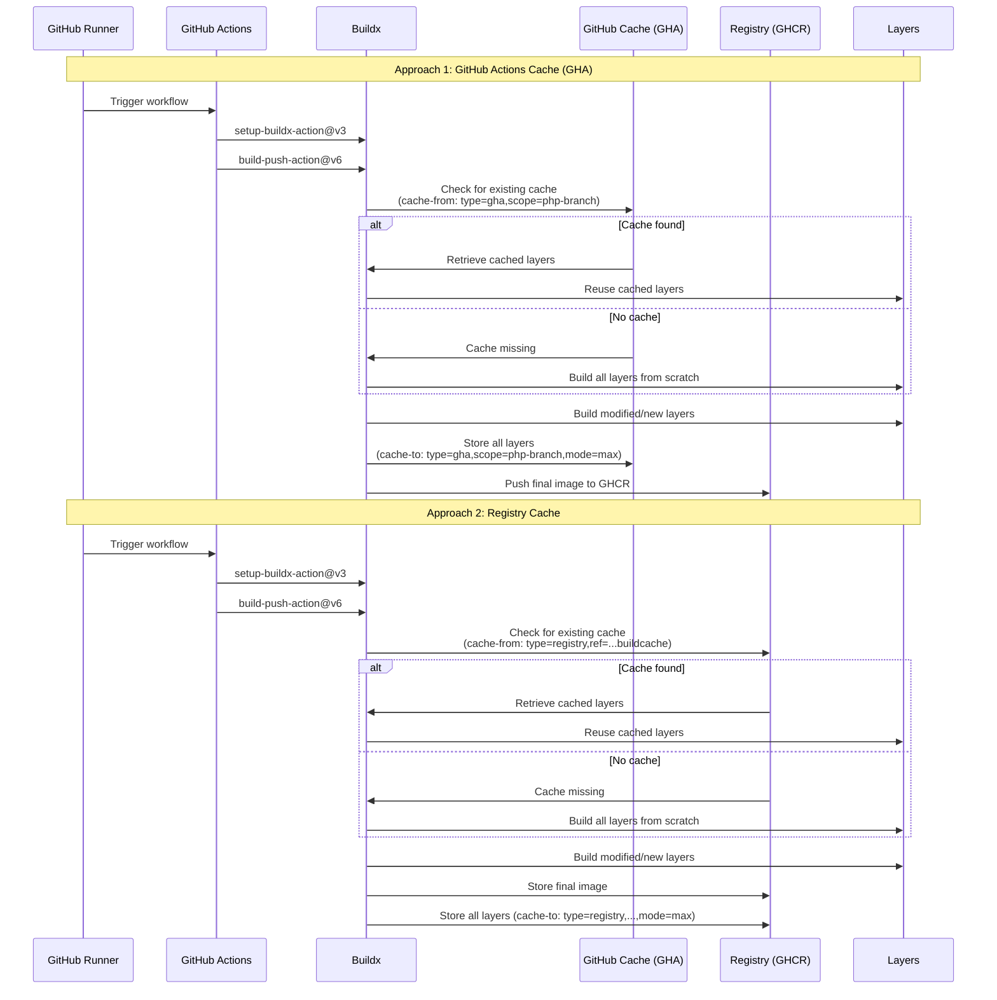

## Sequence Diagram Explanation

### Approach 1: GitHub Actions Cache (GHA)

The GitHub workflow is triggered on the runner
The setup-buildx-action@v3 initializes the Buildx environment
The build-push-action@v6 starts the build process
Buildx checks if a cache exists in GitHub Actions Cache with the specified scope (php-${{github.ref}})

If a cache is found, layers are retrieved and reused
Otherwise, all layers are built from scratch

Modified or new layers are built
All layers are stored in GitHub Actions Cache with mode=max (which includes even intermediate sub-layers)
The final image is pushed to GitHub Container Registry (GHCR)

## Approach 2: Registry Cache

The GitHub workflow is triggered on the runner
The setup-buildx-action@v3 initializes the Buildx environment
The build-push-action@v6 starts the build process
Buildx checks if a cache exists in the Registry (GHCR) with the specified reference

If a cache is found, layers are retrieved and reused
Otherwise, all layers are built from scratch

Modified or new layers are built
The final image is pushed to the Registry
All layers are stored in the Registry with mode=max

## Key Differences Between the Two Approaches

**Storage:** GHA uses GitHub Actions' internal cache, while the second approach uses the Registry (GHCR) as a caching mechanism
**Persistence:** GHA cache may be limited by GitHub's retention policies, while Registry cache persists as long as images are not deleted
**Sharing:** Registry cache can be more easily shared between different workflows and environments
**Performance:** Registry cache may be faster for large builds, as it's optimized for storing Docker layers

Both approaches use mode=max to ensure all intermediate layers are also cached, maximizing the chances of reusing existing layers in subsequent builds.
