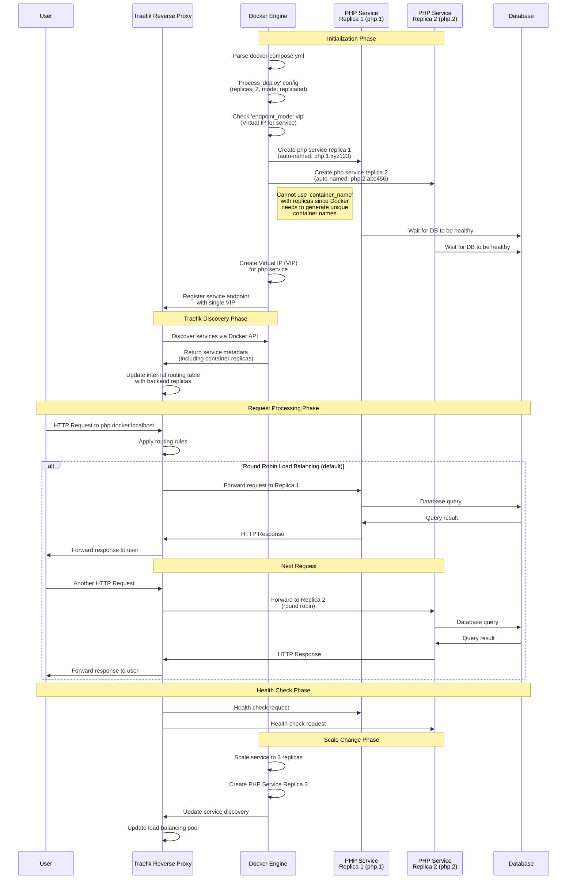

# Docker Replicas and Traefik Load Balancing

This document explains how Docker manages service replicas and how Traefik performs load balancing across these replicas.

## Sequence Diagram

## Key Concepts Explained

### Docker Replicas Configuration

1. **Service Replication**:
    - The `deploy.replicas` setting in docker-compose.yml specifies how many instances of a service to run
    - `mode: replicated` tells Docker to maintain the specified number of replicas
    - Docker automatically generates unique names for each replica (e.g., php.1.xyz123, php.2.abc456)

2. **Container Name Restriction**:
    - You cannot use `container_name` with replicated services
    - Docker needs to generate unique container names for each replica
    - Format is typically: `service_name.replica_number.container_id_short`

3. **Endpoint Mode**:
    - `endpoint_mode: vip` (Virtual IP) creates a single virtual IP for the service
    - Clients connect to the VIP, and Docker's internal routing handles directing to available replicas
    - Alternative is `dnsrr` (DNS Round Robin) for DNS-based load balancing

### Traefik Load Balancing

1. **Service Discovery**:
    - Traefik connects to Docker's API to discover services and their replicas
    - It automatically detects when replicas are added or removed
    - Services are registered with Traefik either through Docker labels or dynamic configuration

2. **Load Balancing Methods**:
    - Default method is Round Robin (sends requests in rotation to each replica)
    - Traefik supports other methods:
        - `wrr`: Weighted Round Robin
        - `sticky`: Session affinity (same client always goes to same replica)

3. **Health Checks**:
    - Traefik periodically checks replica health
    - Unhealthy replicas are removed from the load balancing pool
    - When a replica returns to healthy status, it rejoins the pool

4. **Scale Changes**:
    - When replicas are added or removed, Docker notifies Traefik
    - Traefik automatically updates its routing tables
    - No configuration changes needed for dynamic scaling

This architecture enables horizontal scaling and high availability without requiring manual intervention for routing configuration.
