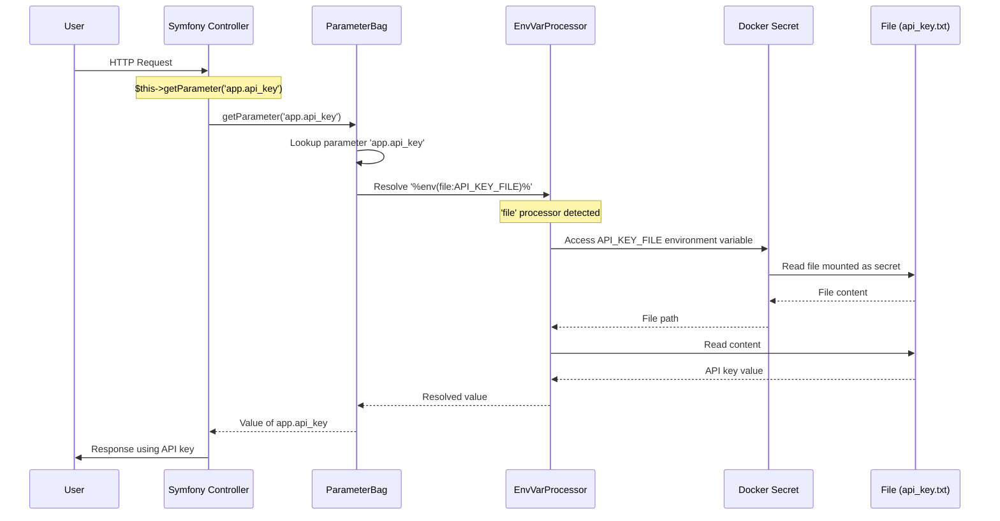

## Sequence Diagram

## Process Explanation

1. **Request Handling**: When a user sends an HTTP request, the Symfony controller processes it.

2. **Parameter Request**: The controller needs the API key and calls `$this->getParameter('app.api_key')`.

3. **Parameter Resolution**:
    - Symfony looks up the parameter defined in `services.yaml`
    - It finds the pattern `%env(file:API_KEY_FILE)%`
    - The `file:` prefix tells Symfony to use the file environment variable processor

4. **Environment Variable Processing**:
    - The processor reads the `API_KEY_FILE` environment variable
    - This variable contains the path to the mounted Docker secret

5. **Secret Access**:
    - Docker has mounted the file `secrets/api_key.txt` into the container
    - The environment processor reads the content of this file

6. **Value Return**:
    - The content of the file is returned as the value of the parameter
    - The controller can now use the API key securely

## Benefits

- API keys and other secrets are never hardcoded in the codebase
- Secrets can be managed independently from the application code
- Different environments can use different secrets without code changes
- The actual secret values never appear in environment variables (only file paths do)
