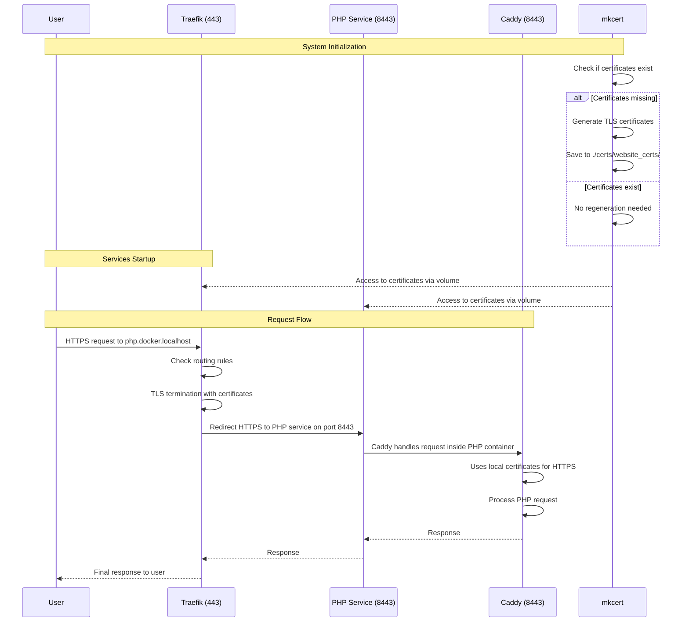

---

# Traefik HTTPS Architecture with Caddy and PHP

This sequence diagram illustrates the architecture and communication flow of a Docker-based development environment using Traefik as a reverse proxy, with TLS termination and HTTPS communication to a PHP service running Caddy.

## Sequence Diagram

## Architecture Details

### Certificate Management:

The mkcert service checks for and generates TLS certificates for docker.localhost and *.docker.localhost
Certificates are stored in ./certs/website_certs/ and shared via Docker volumes

### Service Configuration:

Traefik: Acts as the main reverse proxy, listening on ports 80 and 443
PHP Service: Exposes port 8443 internally for HTTPS
Caddy: Functions as the web server within the PHP container on port 8443

Request Flow:

External requests come in through Traefik on port 443
Traefik routes requests to the appropriate service based on hostname
For php.docker.localhost, Traefik forwards to the PHP service on port 8443
The PHP service uses Caddy to handle the request and process PHP code
Responses flow back through the same path

This end-to-end HTTPS setup provides a secure local development environment with self-signed certificates.
